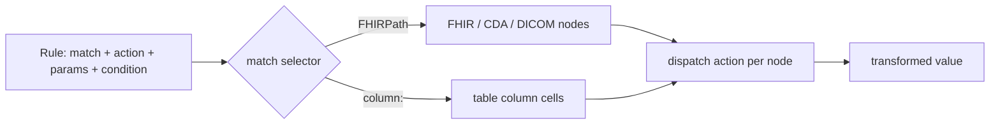
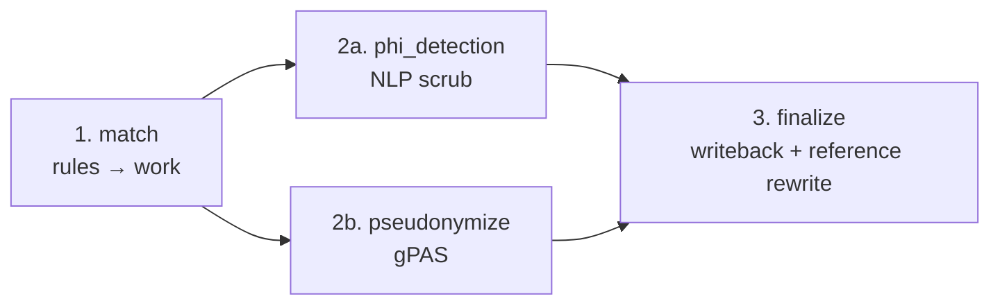

# How the Rule Engine Works

De-identification here is **rule-driven** rather than hard-coded. A config is an
ordered list of `match → action` rules; the engine evaluates them against each
resource and applies the matching actions. This section explains *why* that
design, and *how* a rule turns into a transformation.

## Why rules instead of code

| Property | Why it matters |
|---|---|
| **Auditable** | A reviewer reads YAML, not Python. Rules map directly to a data-governance policy. |
| **Modifiable without a deploy** | Profiles are stored and edited over the API / UI; no code change to add a field. |
| **Portable across data types** | The same actions apply whether the field came from FHIR, a CDA section, or a table column. |
| **Toolable** | Because rules are structured data, the system can validate them, detect conflicts, check coverage, and let AI generate them. |

## From rule to transformation

A rule's `match` is evaluated by the appropriate selector engine for the data
type, producing a set of nodes; the rule's `action` is dispatched on each node.

The selector dialect differs by data type
([FHIRPath vs `column:`](../reference/rules.md#match-dialects-per-data-type)) but
the action set is shared, which is what makes one rule model span FHIR, CDA,
DICOM, HL7 v2, tabular, and SQL.

## Where rules run in the pipeline

For FHIR, rule evaluation is the **match** stage of the four-stage batch
pipeline. The match stage accumulates work for the two concurrent middle
stages, NLP scrubbing and gPAS pseudonymization, which then feed finalize:

See [Architecture](./architecture.md) and [Data flow](./data-flow.md) for the
full stage detail, and [Scoring](./scoring-system.md) for how output is
evaluated and gated afterward.

## Ordering, conditions, and fail-closed behaviour

- **Priority** gives deterministic ordering (lower first; ties keep YAML order),
  so a narrow rule can pre-empt a broad catch-all.
- **Conditions** let a rule fire only for certain resources; a malformed
  condition evaluates to "no match" rather than crashing the run.
- **Fail-closed**: when a FHIRPath eval errors in *skip* mode the element is
  redacted at its path prefix; if even that fails the whole resource is
  quarantined, output is never emitted unprocessed. NLP similarly substitutes
  `[NLP_UNAVAILABLE]` rather than leak text.

This is why the [output gate](./scoring-system.md) and the rule engine together
give a defensible guarantee: a misconfigured or failing rule degrades to *more*
redaction, never less.
