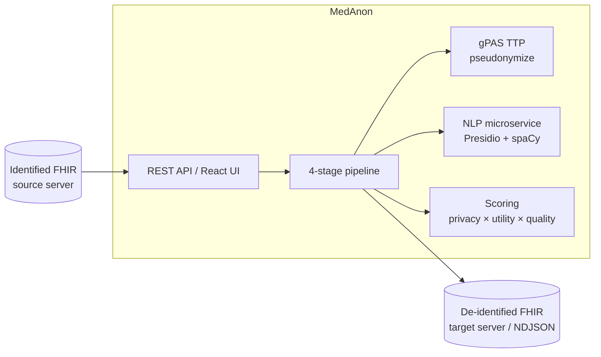

# MedAnon

**MedAnon** is a rule-driven healthcare data
de-identification and pseudonymization engine. It transforms identified patient
records, FHIR R4 resources, HL7 v2 messages, DICOM, CDA/CCDA, and tabular/SQL
sources, into privacy-safe equivalents that can be shared with research
institutions, analytics platforms, or data-space connectors without exposing
patient identity.

## What it does well

1. **Author your own rules.** A rule is a `match → action` pair in readable,
   auditable YAML. You choose the fields and the transformation:
   `redact`, `cryptohash`, `encrypt`, `generalize`, `date_shift`, `tokenize`,
   `mask`, `perturb`, `substitute`, NLP scrub, or gPAS pseudonymize, each with
   optional conditions and priorities. See [Rules](./reference/rules.md) and
   [Author rules](./how-to/author-rules.md).
2. **The same rule model spans many data types.** Write rules for FHIR (R4
   JSON/NDJSON/XML), CDA/CCDA, DICOM, HL7 v2, and tabular/SQL sources. FHIR and
   XML formats select fields with **FHIRPath**; tabular and SQL use a
   **`column:`** matcher dialect, but the action set and tooling are shared.
   See [Data types](./how-to/deidentify-tabular.md).
3. **AI-assisted rule creation.** Describe your intent in natural language and
   the AI agents generate a complete, validated config; a chat assistant answers
   "why redact this field?"; a field scanner classifies a sample and suggests an
   action per field; an explainer maps rules to regulations. See
   [AI-assisted rules](./how-to/ai-assisted-rules.md).
4. **Reversible pseudonymization + scored output.** Through **gPAS** (a
   trusted-third-party service) IDs are pseudonymized reversibly under controlled
   conditions. Every processed resource can be scored for
   **privacy × utility × quality** and gated against leaks.

## Who this is for

| Audience | Start here |
|---|---|
| **New users** | [Getting Started](./tutorials/getting-started.md) |
| **Rule authors** | [Author rules](./how-to/author-rules.md) · [Rules reference](./reference/rules.md) · [AI-assisted rules](./how-to/ai-assisted-rules.md) |
| **Integrators / developers** | [REST API reference](./reference/api.md) · [Architecture](./explanation/architecture.md) |
| **Operations** | [Deploy with Docker](./how-to/deploy-docker.md) · [Operations runbook](./how-to/operations-runbook.md) |
| **Compliance / data stewards** | [De-identification policies](./explanation/policies.md) · [Scoring system](./explanation/scoring-system.md) |

## System at a glance

The pipeline runs **four named stages** per batch, `match` →
(`phi_detection` ‖ `pseudonymize`) → `finalize`. The middle two stages run
concurrently: NLP scrubs free text while gPAS fetches pseudonyms. See
[Architecture](./explanation/architecture.md) and [Data flow](./explanation/data-flow.md).

## How this documentation is organised

This site follows the **[Diátaxis](https://diataxis.fr/) framework**. It defines
four modes of documentation, each serving a different need:

- **[Tutorials](./tutorials/getting-started.md):** learning-oriented lessons.
- **[How-to guides](./how-to/deploy-docker.md):** task-oriented recipes.
- **[Reference](./reference/api.md):** information-oriented facts (API, config, components).
- **[Explanation](./explanation/architecture.md):** understanding-oriented discussion.

See [Documentation Methodology](./methodology.mdx) for why we use this structure
and where to put new content.
