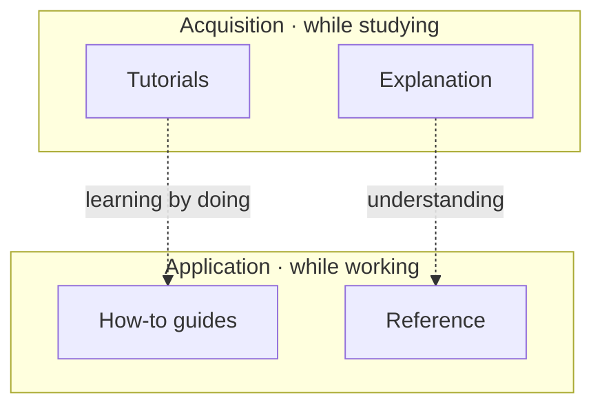

# Documentation Methodology

This documentation is organised with the **[Diátaxis](https://diataxis.fr/)**
framework. Diátaxis identifies four distinct documentation needs and keeps them
in separate places, because mixing them is the most common cause of docs that
are simultaneously too long and not useful.

## The four quadrants

| Mode | Serves | Answers | Voice |
|---|---|---|---|
| **Tutorials** | Learning | "Teach me to use this." | Lessons; we lead, you follow |
| **How-to guides** | A task | "How do I accomplish X?" | Recipes; assumes competence |
| **Reference** | Looking up facts | "What is the exact signature/value?" | Dry, accurate, exhaustive |
| **Explanation** | Understanding | "Why does it work this way?" | Discursive; design rationale |



## Where to put new content

Ask two questions before writing:

1. **Is the reader studying or working?** Studying → tutorial/explanation.
   Working → how-to/reference.
2. **Is this about practical steps or theoretical knowledge?** Practical →
   tutorial/how-to. Theoretical → explanation/reference.

Concretely, for this project:

- A new endpoint → document it in **Reference › [REST API](./reference/api.md)**.
- A new env var → **Reference › [Configuration](./reference/configuration.md)**.
- "How do I export a cohort?" → **How-to**.
- "How does the scoring gate decide to block?" → **Explanation › [Scoring](./explanation/scoring-system.md)**.
- A first-run walkthrough → **Tutorials**.

## Authoring conventions

- **One H1 per page**, set via the `title` frontmatter or a leading `#`.
- Use **Mermaid** for diagrams (` ```mermaid ` fenced blocks) so they render and
  diff as text, no binary image assets.
- Cross-link with **relative `.md` links** (e.g. `./reference/api.md`) so
  Docusaurus validates them at build time.
- Keep **code blocks runnable** and language-tagged (`bash`, `yaml`, `json`,
  `python`).
- Reference env vars and config keys in `code` and keep their canonical
  description in Reference only, link to it elsewhere rather than restating.

## Source of truth

The published docs in this site are the **public** source of truth. Internal
planning notes, roadmaps, and review ledgers live under `docs/internal/`
(gitignored) and are intentionally **not** part of this site.
